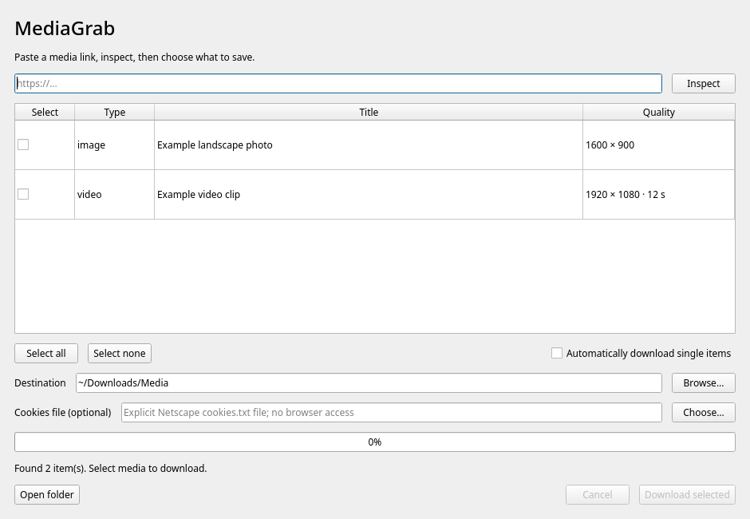

# MediaGrab

**Copy a link. Save its videos and images.**

A desktop downloader for Linux and Windows, powered by [yt-dlp](https://github.com/yt-dlp/yt-dlp)
and [gallery-dl](https://github.com/mikf/gallery-dl).

## Use it

1. **Copy** one media URL.
2. **Open MediaGrab** from your application menu.
3. **Find your files** in `~/Downloads/Media/<source>/`. MediaGrab opens your file
   manager and selects them when supported.

No link in the clipboard? Paste it into the small input window and press **Enter**.



*Optional full window, shown with synthetic example items.*

## Features

- **Choose what to save:** use the full window for individual items and settings.
- **Stay in control:** progress, cancellation, and confirmation before collections.
- **Keep existing files:** content-checked duplicates and no-overwrite downloads.
- **Keep it local:** clipboard read once per launch; no automatic browser-cookie access.

## Install

Setup uses the commands below; everyday use is graphical.

<details>
<summary>Linux source setup</summary>

Requires **Linux**, Python **3.11+**, a graphical session with D-Bus, and
**FFmpeg/ffprobe**. YouTube may also require a Node.js version supported by
[yt-dlp](https://github.com/yt-dlp/yt-dlp/wiki/EJS).

Clone or download this repository, open its directory, then run:

```bash
python3 -m venv .venv
.venv/bin/python -m pip install .
./scripts/install-desktop.sh
```

Open **MediaGrab** from the application menu. Keep this checkout in place:
the menu entry uses it. See [setup and updates](docs/DEVELOPMENT.md) for details.

</details>

On **Windows**, follow the [prerequisites](docs/DEVELOPMENT.md#windows-source-installation),
then double-click **Install-Windows.cmd**. Open MediaGrab from the Start menu.
Tested on Windows 11; see [coverage and limits](docs/VERIFICATION.md).

## Before downloading

Website changes, login requirements, and rate limits can prevent
downloads; [link support](docs/USAGE.md#site-support-and-limits) depends on the
engines. Clipboard access and file selection depend on your desktop. Destinations
must support hard links and file locking (use NTFS on Windows). Download only media you are entitled
to save, following the website's terms.

[User guide and troubleshooting](docs/USAGE.md) · [Test coverage](docs/VERIFICATION.md)

**License:** MediaGrab's own code is [MIT licensed](LICENSE). Dependencies retain
their own licenses; see [licensing details](docs/LICENSING.md) and
[third-party notices](THIRD_PARTY_NOTICES.md).
